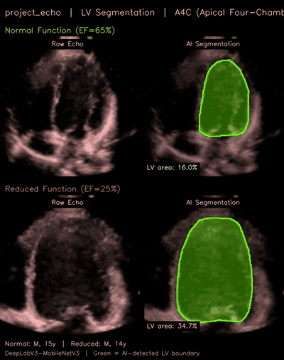
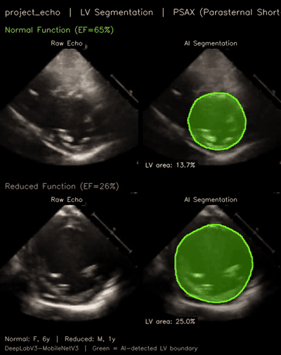

# project_echo 🫀

**project_echo: AI-Assisted Pediatric Cardiac Function Assessment with MedGemma**

> **MedGemma Impact Challenge 2026** · Main Track · Agentic Workflow · Novel Task · Edge AI
>
> First-ever application of MedGemma to echocardiography — zero training data
> contamination, clinically impactful, privacy-first, runs entirely on a laptop.
>
> 📄 [Competition Writeup →](SUBMISSION.md)

---

## Overview

project_echo is an **agentic "second opinion"** system that estimates pediatric
ejection fraction (EF) from echocardiography videos using an 8-specialist Model
Garden, geometric EF via LV segmentation, and MedGemma 4B VLM visual validation.

### Why This Matters

- **1.35M+ children** live with congenital heart disease in the US [5]
- Pediatric echo interpretation requires **specialized training** (3+ year fellowship)
- Rural/underserved areas face critical **workforce shortages**
- $150k+ echo machines have Auto-EF but **fail on fast-beating pediatric hearts**
- A **$2k handheld POCUS probe + laptop** running project_echo fills the gap

---

## Example: Real-Time AI Segmentation of the Left Ventricle

project_echo uses DeepLabV3 to automatically segment the left ventricle (LV) in
every frame of a pediatric echocardiogram, then computes ejection fraction from
the area change between end-diastole (max filling) and end-systole (max contraction).

### A4C View — Apical Four-Chamber



*Real-time LV segmentation on the A4C view. **Top:** Normal cardiac function
(EF ≈ 65%) — the ventricle contracts vigorously from ED to ES. **Bottom:**
Severely reduced function (EF ≈ 25%) — minimal wall motion, the ventricle
barely squeezes. Green overlay = AI-detected LV boundary.*

### PSAX View — Parasternal Short-Axis



*Cross-sectional "donut" view. The AI segments the circular LV cross-section
and tracks area change across the cardiac cycle. PSAX achieves our best
segmentation IoU (0.828) due to the near-circular geometry.*

---

## Model Accuracy

All models trained exclusively on EchoNet-Pediatric data [1] (7,810 videos).
No curriculum learning or adult pre-training was used.

### A4C View (Apical Four-Chamber)

| Role | Architecture | Val MAE ↓ | R² ↑ | Clinical Accuracy |
|------|-------------|-----------|------|-------------------|
| Pattern Matcher | **TCN** | **5.49%** | **0.4368** | **76.2%** |
| Motion Analyst | Temporal Transformer | 5.78% | 0.3622 | 74.1% |
| Guardrail | Multi-Task | 6.14% | 0.3153 | 67.9% |
| Baseline | MLP | 6.55% | 0.2703 | 67.0% |

### PSAX View (Parasternal Short-Axis)

| Role | Architecture | Val MAE ↓ | R² ↑ | Clinical Accuracy |
|------|-------------|-----------|------|-------------------|
| Motion Analyst | **Temporal Transformer** | **5.08%** | **0.5363** | **74.8%** |
| Pattern Matcher | TCN | 5.14% | 0.4988 | 74.6% |
| Guardrail | Multi-Task | 5.43% | 0.4803 | 69.6% |
| Baseline | MLP | 5.64% | 0.4394 | 67.2% |

### Geometric EF (DeepLabV3 Segmentation)

| View | Segmentation IoU | Graduated Ensemble MAE |
|------|-----------------|------------------------|
| A4C | 0.809 | — |
| PSAX | 0.828 | 4.97% |

### Why VLM Text Generation Failed (All Negative R²)

| Approach | MAE | R² | Verdict |
|---|---|---|---|
| VLM Zero-shot | 9.33% | -0.22 | Worse than mean |
| VLM LoRA SFT | 7.33% | -0.17 | Negative R² |
| VLM GRPO v1–v4 | 6.95–17.3% | all neg | Mode collapse |
| **VideoMAE TCN (A4C)** | **5.49%** | **+0.44** | ✅ |
| **VideoMAE Temporal (PSAX)** | **5.08%** | **+0.54** | ✅ |

**Root cause:** Cross-entropy loss treats "60%" and "62%" as equally distant as
"60%" and "banana". Huber loss provides proper ordinal regression signal.

---

## Clinical Workflow Context

### How Clinicians Use Echocardiography

A pediatric echocardiogram begins when a pediatrician or neonatologist detects
a murmur, abnormal pulse oximetry, or symptoms of cardiac dysfunction. A trained
cardiac sonographer acquires standardized echo views over **30–60 minutes** [1]
— longer for uncooperative children with heart rates of 100–160 BPM. A
fellowship-trained pediatric cardiologist then interprets the images (15–30
minutes), assessing chamber sizes, wall motion, valve function, and EF. Reports
typically reach the referring physician in 24–48 hours.

### The Two Views project_echo Analyzes

**Apical Four-Chamber (A4C):** Obtained by placing the transducer at the cardiac
apex, visualizing all four chambers simultaneously [6]. Clinicians assess global
LV function, regional wall motion (basal/mid/apical segments), mitral and
tricuspid valve function, atrial sizes, and septal defects (ASD/VSD). The A4C
provides the **long-axis LV length** essential for volumetric EF calculation via
biplane Simpson's method [7].

**Parasternal Short-Axis (PSAX):** Obtained from the left parasternal window,
producing a cross-sectional "donut" view of the LV [6]. The PSAX displays all
6 mid-ventricular wall segments simultaneously — the single best view for
detecting regional wall motion abnormalities. It provides the **LV
cross-sectional area** for the 5/6 × A × L (area-length) EF method used in
EchoNet-Pediatric [1].

**Why both views matter:** The area-length EF method requires both — PSAX for
cross-sectional area, A4C for long-axis length [6]. project_echo processes both
independently with separate ensembles and fuses conservatively, flagging
|ΔEF| > 10% discordance. This mirrors how cardiologists integrate information
from multiple acoustic windows.

### Inter-Observer Variability

Two expert echocardiographers may measure EF values differing by **5–10
percentage points** on the same study [7], due to endocardial border tracing
differences and frame selection. project_echo provides a **reproducible,
deterministic estimate** (MAE 5.08–5.49%) within the range of expert
inter-observer variability.

---

## Agentic Pipeline

project_echo operates as an **agentic cardiology department in software** —
a multi-stage pipeline where specialized models measure, verify, validate,
and synthesize, mirroring the real clinical workflow of sonographer →
technician → attending cardiologist → report.

```
┌──────────────────────────────────────────────────────────────────────┐
│                    project_echo Pipeline                             │
│                                                                      │
│  LAYER 1 — MEASURE (Specialist Roundtable)                           │
│  AVI → VideoMAE [3] (frozen, 86M params) → (16, 768) embeddings     │
│  → 4 Specialists vote: TCN + Temporal + MultiTask + MLP              │
│  → Weighted ensemble EF ± inter-specialist σ                         │
│                                                                      │
│  LAYER 1.5 — GEOMETRIC VERIFICATION (DeepLabV3 Segmentation)        │
│  AVI → DeepLabV3 [4] → LV mask per frame → ED/ES area               │
│  → Calibrated geometric EF → Graduated blend with regression EF      │
│                                                                      │
│  LAYER 2 — VALIDATE (MedGemma VLM Critic)                            │
│  MedGemma 4B [2] as "Senior Attending Cardiologist"                   │
│  Receives: specialist votes + key frames + clinical context           │
│  → AGREE / UNCERTAIN / DISAGREE + LV description + reasoning         │
│                                                                      │
│  LAYER 3 — SYNTHESIZE (Clinical Report)                              │
│  Dual-view fusion + age-adjusted Z-scores + BSA indexing              │
│  → Structured pediatric echo report with confidence intervals         │
└──────────────────────────────────────────────────────────────────────┘
```

### Layer 1: Specialist Roundtable — 4 Architectures, 1 Ensemble

Each echo video passes through a **frozen VideoMAE encoder** [3] (MCG-NJU/videomae-base,
pre-trained on Kinetics-400 action videos — no medical data). This produces
spatiotemporal embeddings of shape `(16, 768)` — 16 frames × 768-dimensional
feature vectors capturing both spatial anatomy and temporal motion patterns.

Four lightweight regression heads then independently estimate EF, each bringing
a different inductive bias — like four specialists reading the same study:

| Specialist | Architecture | Why It Exists | A4C MAE | A4C Acc | PSAX MAE | PSAX Acc |
|---|---|---|---|---|---|---|
| **Pattern Matcher** | TCN (dilated convolutions) | Captures multi-scale temporal patterns (dilation 1,2,4,8) | **5.49%** | **76.2%** | 5.14% | 74.6% |
| **Motion Analyst** | Temporal Transformer (2-layer, 8-head) | Attends to frame-to-frame motion relationships | 5.78% | 74.1% | **5.08%** | **74.8%** |
| **Guardrail** | Multi-Task (regression + classification) | Joint loss prevents extreme outliers via category bounds | 6.14% | 67.9% | 5.43% | 69.6% |
| **Baseline** | MLP (mean-pooled) | Ablation anchor — proves temporal modeling helps | 6.55% | 67.0% | 5.64% | 67.2% |

The ensemble combines predictions using performance-weighted voting:

$$w_i = \frac{1}{\text{MAE}_i} \times (1 + R^2_i) \times (1 + \text{ClinAcc}_i)$$

The **inter-specialist standard deviation (σ)** serves as an uncertainty signal:
low σ (< 3%) means all four agree → high confidence; high σ (> 8%) means
disagreement → the case needs closer review. Specialists deviating > 10% from
the consensus are flagged as outliers in the UI.

### Layer 1.5: Geometric EF — DeepLabV3 LV Segmentation

Independent of the regression ensemble, project_echo computes a **physics-based
geometric EF** by segmenting the left ventricle in every video frame:

1. **Segmentation:** DeepLabV3-MobileNetV3 [4] models trained on expert LV
   contours from EchoNet-Pediatric's VolumeTracings.csv (A4C IoU = 0.809,
   PSAX IoU = 0.828)
2. **ED/ES Detection:** The frames with maximum and minimum LV area are
   identified as end-diastole and end-systole
3. **Area-Based EF:** $\text{EF}_\text{geo} = \frac{A_\text{ED} - A_\text{ES}}{A_\text{ED}} \times 100$
4. **Linear Calibration:** Corrects systematic bias (A4C: slope=0.378,
   intercept=46.66; PSAX: slope=0.752, intercept=20.66)
5. **Graduated Ensemble Blending:** Geometric and regression EF are combined
   with trust weights that vary by EF range:

| EF Range | Geometric Weight | Regression Weight | Rationale |
|---|---|---|---|
| < 40% (reduced) | **80%** | 20% | Structural abnormality → geometric more reliable |
| 40–55% (borderline) | 50% | 50% | Equal trust in transition zone |
| > 55% (normal) | 30% | **70%** | Regression more precise in normal range |

This graduated blending achieves **MAE 4.97%** on PSAX — our best single-view
result — and **65.8% sensitivity for abnormal EF** (highest of any method),
because the geometric approach directly measures what clinicians care about:
how much the ventricle actually shrinks.

### Layer 2: MedGemma VLM Critic — "Senior Attending" Visual Validation

MedGemma 4B [2] serves as the **agentic intelligence** of project_echo — not
predicting EF (VLM text generation failed; see table above), but acting as a
**senior attending cardiologist** who reviews the junior team's work.

**What MedGemma receives:**
- 3 key frames at 448×448 resolution (end-diastole, mid-systole, end-systole)
- All 4 specialist predictions with their role labels and architectures
- Ensemble EF with inter-specialist σ and outlier flags
- Clinical context: patient age, sex, BSA, and age-adjusted Z-score
- Sigma guidance text (low/moderate/high agreement interpretation)

**What MedGemma produces:**
- **LV Description:** What the VLM observes in the images (wall motion,
  chamber size, contractility assessment)
- **Clinical Verdict:** `AGREE` / `UNCERTAIN` / `DISAGREE` with natural
  language reasoning explaining *why*

**How the verdict adjusts confidence:**

| Verdict | Confidence Multiplier | Interpretation |
|---|---|---|
| `AGREE` | ×1.10 | VLM confirms — visual appearance matches predicted EF |
| `UNCERTAIN` | ×0.85 | Image quality or borderline findings — flag for review |
| `DISAGREE` | ×0.60 | VLM sees something the regression missed — needs attention |

This is the core **agentic pattern**: MedGemma doesn't replace the specialists,
it *supervises* them — exactly as an attending physician would review a trainee's
measurements before signing the report. The VLM's medical image understanding
(trained on CXR, CT, histopathology, ophthalmology [2]) transfers to echo
despite zero echo training data, enabling it to assess LV contractility,
chamber proportions, and wall motion qualitatively.

### Layer 3: Clinical Synthesis — Dual-View Fusion & Reporting

When both A4C and PSAX videos are available, project_echo fuses them
conservatively, mirroring how cardiologists integrate multiple acoustic windows:

- **Primary view** = the view with the **lower EF** (more pathological) —
  in clinical practice, you always act on the more concerning reading
- **|ΔEF| > 10%** triggers a disagreement flag with reduced confidence,
  alerting the clinician to a potential technical issue or true regional dysfunction
- **Age-adjusted Z-scores** normalize the EF relative to pediatric norms
  (neonates, infants, toddlers, children, adolescents have different thresholds)
- **BSA indexing** accounts for body surface area in the clinical narrative

The final output is a **structured pediatric echo report** with:
- EF estimate ± confidence interval (8 specialist votes)
- Age-adjusted Z-score and clinical category (normal/borderline/reduced/hyperdynamic)
- Geometric EF cross-check with graduated blending details
- MedGemma VLM visual validation with LV description and reasoning
- Dual-view fusion with any disagreement flags
- Natural language clinical narrative suitable for the medical record

---

## Quick Start

### 1. Build the Virtual Environment

Requires **Python 3.10+** and a supported GPU:
- **NVIDIA GPU** with CUDA 12.x (recommended for training + inference)
- **Apple Silicon** (M1/M2/M3/M4) via MPS (inference and demo only)

```bash
cd project_echo

# Create and activate the virtual environment
python3 -m venv .venv
source .venv/bin/activate

# Install PyTorch — choose one:
# CUDA (Linux/Windows with NVIDIA GPU):
pip install torch torchvision --index-url https://download.pytorch.org/whl/cu124
# Apple Silicon (macOS):
pip install torch torchvision

# Install the package in editable mode (installs all dependencies from pyproject.toml)
pip install -e .

# Verify installation
python -c "import echoguard; print('echoguard installed successfully')"
python -c "import torch; print(f'CUDA: {torch.cuda.is_available()}, MPS: {torch.backends.mps.is_available()}')"
```

Key dependencies installed by `pip install -e .`:
- `torch`, `transformers`, `accelerate` — model inference
- `opencv-python`, `pillow` — video/image processing
- `numpy`, `pandas`, `scikit-learn` — data handling
- `fastapi`, `uvicorn` — demo API server

### 2. Download Models

```bash
# 1. Accept the MedGemma license: https://huggingface.co/google/medgemma-4b-it
# 2. Add your Hugging Face token to .env:
echo "HF_TOKEN=hf_your_token_here" >> .env

# 3. Run the download script (downloads MedGemma 4B + pre-caches VideoMAE):
bash download_models.sh

# Or skip the VLM if you only need regression inference:
bash download_models.sh --skip-vlm
```

See [local_models/README.md](local_models/README.md) for details on each model.

### 3. Download EchoNet-Pediatric Dataset

The dataset is hosted by Stanford AIMI and requires a Data Use Agreement:

1. Visit **https://stanfordaimi.azurewebsites.net/**
2. Search for **"EchoNet-Pediatric"**
3. Sign in with a **Microsoft account**
4. Accept the **Stanford Research Use Agreement** (DUA)
5. Click **"Export Dataset"** → copy the Azure SAS URL
6. Download:

```bash
# Install azcopy if needed:
# https://learn.microsoft.com/en-us/azure/storage/common/storage-use-azcopy-v10

# Download the dataset (~2.4 GB)
azcopy copy "<SAS_URL>" ./data/echonet_pediatric --recursive

# Alternative: wget (if SAS URL points to a zip)
wget -O echonet_pediatric.zip "<SAS_URL>"
unzip echonet_pediatric.zip -d ./data/echonet_pediatric
```

Expected structure:
```
data/echonet_pediatric/
├── A4C/
│   ├── Videos/            (3,284 .avi files)
│   ├── FileList.csv       (FileName, EF, Sex, Age, Weight, Height, Split)
│   └── VolumeTracings.csv (FileName, X, Y, Frame — LV contour points)
└── PSAX/
    ├── Videos/            (4,526 .avi files)
    ├── FileList.csv
    └── VolumeTracings.csv
```

### 4. Train All Models

```bash
# Full pipeline: extract embeddings → train all 8 specialists → evaluate
bash train.sh

# Skip extraction (re-train with existing embeddings)
bash train.sh --skip-extract

# Train only specific views or model types
bash train.sh --views A4C
bash train.sh --models tcn temporal
bash train.sh --eval-only
```

### Training Reproduction Details

The default hyperparameters in `train.sh` are the **exact values** that produced
all 8 shipped checkpoints. Running `bash train.sh` with no arguments reproduces
the training (given the same data and random seed behavior).

| Hyperparameter | Value | CLI Flag |
|---|---|---|
| Epochs | 100 | `--epochs` |
| Learning Rate | 1e-3 | `--lr` |
| Batch Size | 64 | `--batch-size` |
| Early Stopping Patience | 15 epochs | `--patience` |
| Hidden Dim | 512 | `--hidden-dim` |
| Dropout | 0.3 | `--dropout` |
| Embedding Noise | 0.01 | `--noise` |
| Loss | Huber (δ=5.0) | — |
| Scheduler | Cosine Annealing | — |
| Weight Decay | 1e-4 | — |

**Best-model saving:** During training, a composite score selects the best
checkpoint (lower is better):

$$\text{score} = \text{MAE} - 5.0 \times \text{ClinAcc} - 3.0 \times \max(R^2, 0)$$

This jointly rewards low MAE, high clinical-category accuracy, and high R².
The best model is saved as `best_model.pt` inside each checkpoint directory;
a `final_model.pt` (last epoch) is also saved. Early stopping triggers after
15 epochs with no improvement in composite score.

Each checkpoint stores its full config, metrics, and model weights:
```python
torch.save({
    "epoch": best_epoch,
    "model_state_dict": ...,
    "val_mae": best_val_mae,
    "val_clin_acc": clin_acc,
    "val_r2": r2,
    "composite_score": composite_score,
    "config": config.__dict__,  # all hyperparameters
    "model_type": model_type,
}, "best_model.pt")
```

### 5. Run the Demo

Once all data and models are in place, start the interactive demo:

```bash
# Activate the virtual environment
source .venv/bin/activate

# Start the FastAPI backend
cd src && uvicorn demo_api:app --host 0.0.0.0 --port 8000 --reload

# Open http://localhost:8000 in your browser
```

**Prerequisites checklist** (the server validates all of these at startup):

| Requirement | Path | Notes |
|---|---|---|
| Trained checkpoints (8 specialists) | `checkpoints/regression_videomae_*/` | Each contains `best_model.pt` |
| Segmentation models (2) | `checkpoints/lv_seg_deeplabv3.pt`, `lv_seg_psax_deeplabv3.pt` | DeepLabV3 for geometric EF |
| Geometric calibrations (2) | `checkpoints/a4c_geo_calibration.json`, `psax_geo_calibration.json` | Linear calibration coefficients |
| VideoMAE embeddings | `data/embeddings_videomae/{pediatric_a4c,pediatric_psax}/` | `.pt` files + `manifest.json` |
| Echo videos | `data/echonet_pediatric/{A4C,PSAX}/Videos/` | 7,810 `.avi` files from Stanford AIMI |
| MedGemma 4B (optional) | `local_models/medgemma-4b/` | Required only for VLM validation layer |

**Device auto-detection:** The backend automatically selects CUDA → MPS → CPU.
On Apple Silicon, specialists run on MPS with automatic memory management
(VLM is offloaded/reloaded to stay within unified memory limits).

**What you'll see at startup:**
```
INFO:     Loaded 4,467 patients (A4C: 3284, PSAX: 4526) ...
INFO:     8 specialists on [cuda/mps/cpu]
INFO:     2 segmentation models loaded
INFO:     VLM: [READY/UNAVAILABLE]
```

---

## Dataset

### EchoNet-Pediatric [1]

| Property | Value |
|---|---|
| Source | Stanford AIMI / Lucile Packard Children's Hospital |
| Videos | 7,810 labeled echocardiograms |
| Size | ~2.4 GB |
| Format | AVI, 112×112 pixels |
| Labels | EF, expert LV tracings at ED/ES |
| Ages | 0–18 years |
| Views | 3,284 A4C + 4,526 PSAX |
| Contamination | **NOT in MedGemma training data** [2] ✅ |

### Split Mapping (10-Fold CV → 3-Way)

| Folds | Split | A4C | PSAX |
|---|---|---|---|
| 0–7 | TRAIN | 2,580 | ~3,560 |
| 8 | VAL | 336 | ~470 |
| 9 | TEST | 368 | ~496 |

---

## Project Structure

```
project_echo/
├── README.md                      # This file
├── SUBMISSION.md                  # MedGemma Impact Challenge 2026 writeup
├── agents.md                      # Full technical history & architecture docs
├── train.sh                       # Unified training pipeline
├── download_models.sh             # Automated model download script
├── pyproject.toml                 # Package configuration
│
├── src/                           # All source code
│   ├── demo_api.py                # FastAPI backend (all endpoints)
│   ├── demo_frontend/
│   │   ├── index.html             # Frontend SPA
│   │   └── static/                # Static assets
│   └── echoguard/
│       ├── __init__.py
│       ├── config.py              # Configuration, EF norms, PROJECT_ROOT
│       ├── confidence.py          # Confidence scoring (MC-Dropout)
│       ├── zscore.py              # Pediatric Z-score calculation
│       ├── inference.py           # Inference engine — loads 8 specialists
│       ├── dual_view.py           # Dual-view conservative fusion
│       ├── vlm_critic.py          # MedGemma 4B VLM visual validation
│       ├── video_utils.py         # AVI frame extraction, tracing parser
│       └── regression/
│           ├── __init__.py
│           ├── model.py           # Base MLP model definitions
│           ├── model_garden.py    # TCN, Temporal, MultiTask architectures
│           ├── infer.py           # Inference wrapper
│           ├── geometric_ef.py    # DeepLabV3 segmentation + geometric EF
│           ├── extract_videomae.py# VideoMAE embedding extraction
│           ├── train.py           # Base MLP training loop
│           ├── train_garden.py    # Model Garden training
│           ├── evaluate.py        # Test set evaluation
│           └── evaluate_garden.py # Model Garden evaluation
│
├── local_models/
│   └── medgemma-4b/               # MedGemma 4B weights (download separately)
│
├── data/
│   ├── echonet_pediatric/         # Dataset (download from Stanford AIMI)
│   │   ├── A4C/                   # Videos/, FileList.csv, VolumeTracings.csv
│   │   └── PSAX/                  # Videos/, FileList.csv, VolumeTracings.csv
│   └── embeddings_videomae/       # Pre-extracted VideoMAE embeddings
│       ├── pediatric_a4c/         # .pt files + manifest.json
│       └── pediatric_psax/        # .pt files + manifest.json
│
└── checkpoints/
    ├── README.md                            # Model guide (architecture, roles, metrics)
    ├── regression_videomae_tcn_a4c/         # TCN A4C  (MAE 5.49%, best A4C)
    ├── regression_videomae_a4c/             # Temporal A4C
    ├── regression_videomae_multitask_a4c/   # MultiTask A4C
    ├── regression_videomae_mlp_a4c/         # MLP A4C
    ├── regression_videomae_psax/            # Temporal PSAX (MAE 5.08%, best PSAX)
    ├── regression_videomae_tcn_psax/        # TCN PSAX
    ├── regression_videomae_multitask_psax/  # MultiTask PSAX
    ├── regression_videomae_mlp_psax/        # MLP PSAX
    ├── lv_seg_deeplabv3.pt                  # DeepLabV3 A4C (IoU 0.809)
    ├── lv_seg_psax_deeplabv3.pt             # DeepLabV3 PSAX (IoU 0.828)
    ├── a4c_geo_calibration.json             # A4C geometric calibration
    └── psax_geo_calibration.json            # PSAX geometric calibration
```

---

## Pediatric EF Norms (Age-Adjusted)

| Age Group | Normal EF | Borderline | Reduced |
|---|---|---|---|
| Neonate (0–28d) | ≥ 55% | 45–55% | < 45% |
| Infant (1m–1y) | ≥ 56% | 45–56% | < 45% |
| Toddler (1–3y) | ≥ 57% | 47–57% | < 47% |
| Child (3–12y) | ≥ 55% | 45–55% | < 45% |
| Adolescent (12–18y) | ≥ 52% | 42–52% | < 42% |

## Hardware Requirements

| Resource | CUDA (Training + Inference) | Apple Silicon (Inference Only) |
|---|---|---|
| **GPU** | NVIDIA RTX 5090 (32 GB VRAM) or equivalent | M1/M2/M3/M4 (16+ GB unified memory) |
| **RAM** | 32 GB minimum | 16 GB minimum (32 GB recommended) |
| **Storage** | ~12 GB (models + dataset + checkpoints) | ~12 GB |
| **Framework** | CUDA 12.x with BF16 support | PyTorch MPS backend |

## Competition

This project is a submission to the **[MedGemma Impact Challenge 2026](https://kaggle.com/competitions/med-gemma-impact-challenge)** on Kaggle.

See [SUBMISSION.md](SUBMISSION.md) for the full writeup covering problem statement,
solution architecture, technical details, and track eligibility.

## License

Research use only. EchoNet-Pediatric data subject to Stanford AIMI Research Use Agreement.

---

## References

1. **EchoNet-Pediatric Dataset:** Reddy C, Lopez L, Ouyang D, Zou JY, He B.
   "Video-Based Deep Learning for Automated Assessment of Left Ventricular
   Ejection Fraction in Pediatric Patients." *J Am Soc Echocardiogr*. 2023.
   Dataset: https://echonet.github.io/pediatric/

2. **MedGemma 4B:** Sellergren A, Kazemzadeh S, Jaroensri T, et al.
   "MedGemma Technical Report." arXiv:2507.05201, 2025.
   Model: https://huggingface.co/google/medgemma-4b-it
   Training data: CXR, histopathology, dermatology, ophthalmology, CT —
   **no echocardiography or ultrasound**.

3. **VideoMAE:** Tong Z, Song Y, Wang J, Wang L. "VideoMAE: Masked
   Autoencoders are Data-Efficient Learners for Self-Supervised Video
   Pre-Training." *NeurIPS* 2022. https://arxiv.org/abs/2203.12602
   Model: https://huggingface.co/MCG-NJU/videomae-base
   Pre-trained on Kinetics-400 (no medical data).

4. **DeepLabV3:** Chen LC, Papandreou G, Schroff F, Adam H. "Rethinking
   Atrous Convolution for Semantic Image Segmentation."
   arXiv:1706.05587, 2017. https://arxiv.org/abs/1706.05587

5. **CHD Prevalence:** Gilboa SM, Devine OJ, Kucik JE, et al. "Congenital
   Heart Defects in the United States." *Circulation*. 2016;134(2):101–109.
   https://doi.org/10.1161/CIRCULATIONAHA.115.019307

6. **Pediatric Echocardiography Guidelines:** Lopez L, Colan SD, Frommelt PC,
   et al. "Recommendations for Quantification Methods During the Performance
   of a Pediatric Echocardiogram." *J Am Soc Echocardiogr*. 2010;23(5):465–495.
   https://doi.org/10.1016/j.echo.2010.03.019

7. **Adult Cardiac Chamber Quantification:** Lang RM, Badano LP, Mor-Avi V,
   et al. "Recommendations for Cardiac Chamber Quantification by
   Echocardiography in Adults." *J Am Soc Echocardiogr*. 2015;28(1):1–39.
   https://doi.org/10.1016/j.echo.2014.10.003
